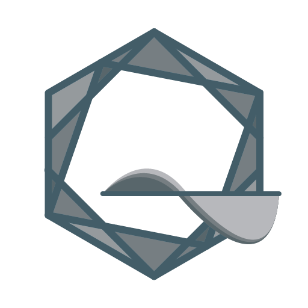
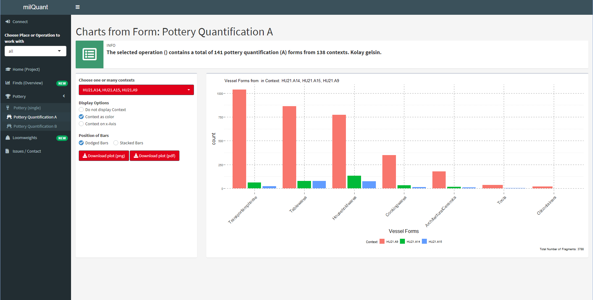
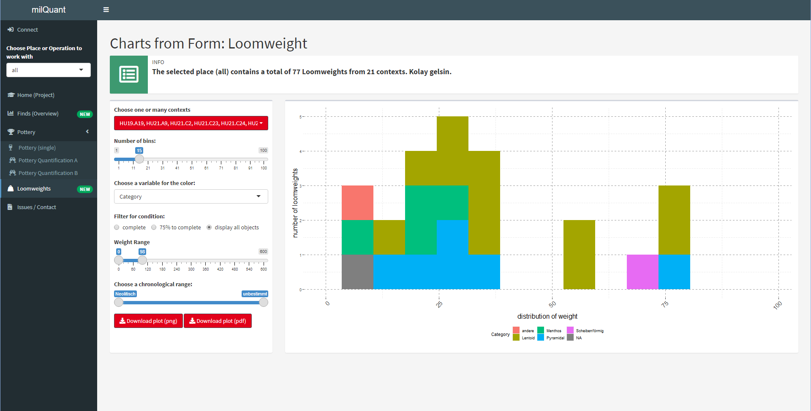

# milQuant -- Quantitative Analysis with Data from Field Desktop <a href='https://www.miletgrabung.uni-hamburg.de/'></a>


The milQuant-Shiny Dashboard provides quick quantitative overviews of the data in a [Field Desktop](https://github.com/dainst/idai-field)-project. It can connect to any database Client in the same Local Area Network and can plot various graphs to provide quantitative visualizations for the project focused on find-resources. See also the standalone app version at [lsteinmann/milQuant-dist](https://github.com/lsteinmann/milQuant-dist).

The dashboard has been developed and is meant to be used with the milet-configuration and within the framework of the [Miletus Excavation Project](https://www.miletgrabung.uni-hamburg.de/). While very limited, some functionality and general overviews may also work with other project-configurations. In any case, the App could be adapted to work for different configurations! Feel free to modify it according to your needs. 





## Current Status

The dashboard is currently operational, though the vocabulary used in all plots comes from the background of the database, and may not always be as expected. On load, a login screen asks the user to input the address for synchronization and the password. Projects can be switched while the app is running. 

The app can handle most errors just fine. It may crash in rare cases - if so, just restart it and try again, and ideally notify me of what exactly lead to the crash so that I can fix it.  

## Dependencies

This app uses the [idaifieldR](https://github.com/lsteinmann/idaifieldR) package (not on CRAN) to import data from Field Desktop. For more info about the package, see [this article](https://doi.org/10.34780/068b-q6c7). 

Apart from that there is a variety of other packages used in the dashboard, all of which can be found on CRAN and are automatically installed when trying to run the app: 
```
require("shiny", "shinydashboard", "shinycssloaders", "shinyjs", "shinyWidgets", "ggplot2", "plotly", "viridis", "dplyr", "reshape2", "forcats", "tidyr", "DT", "remotes", "glue", "datplot")
```

## Adaptation

If you wish to try the app, you only need to clone the repository, open the project in R-Studio and click on "Run App" with "app.R" from the main directory open. You could also install the standalone app version at [lsteinmann/milQuant-dist](https://github.com/lsteinmann/milQuant-dist). Make sure to enter your local IP address (or leave the default, if Field Desktop is running on the same computer) and the password your client uses for synchronization. You can find this info in the settings of your Field Desktop Client. 

As stated, this app will not be very useful with configurations other than "milet". I would be more than happy is you wanted to adapt this for other configurations, though it may not be easy, as I admit the code is a bit of a mess. But still, feel free to clone and change this to your own needs or contact me if you want to discuss about it.
